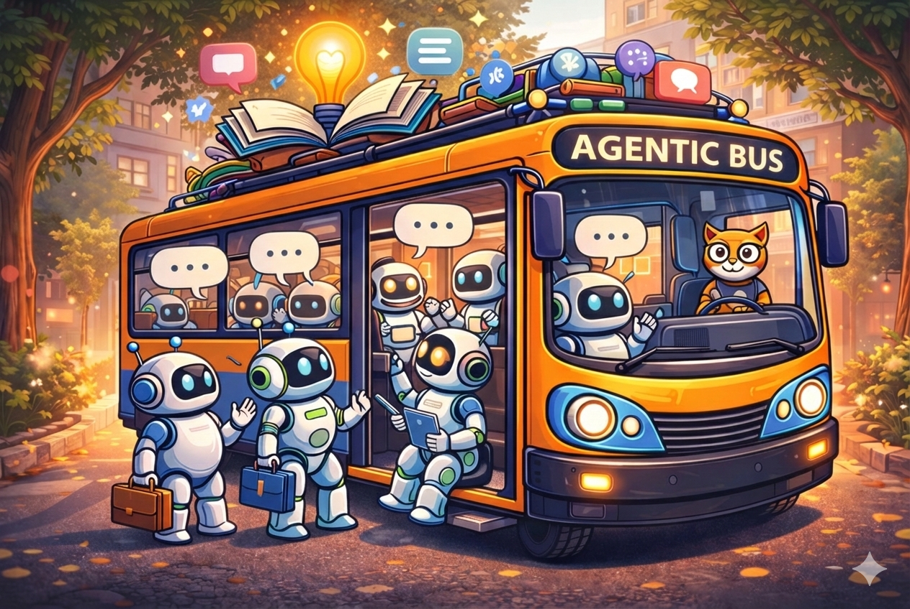

<p align="center">
  
</p>

<h1 align="center">Agentic Bus</h1>

<p align="center">
  <strong>Reference implementation of the Liquid Interfaces Protocol</strong><br>
  A dynamic, negotiation-driven, multi-agent coordination runtime where interfaces are not static contracts — they are ephemeral relational events.
</p>

<p align="center">
  <a href="#-quick-start">Quick Start</a> •
  <a href="#-architecture">Architecture</a> •
  <a href="#-key-concepts">Key Concepts</a> •
  <a href="#-cli-reference">CLI Reference</a> •
  <a href="#-contributing">Contributing</a> •
  <a href="#-license">License</a>
</p>

<p align="center">
  <a href="https://opensource.org/licenses/MIT"></a>
  <a href="https://www.python.org/downloads/"></a>
  <a href="https://github.com/langchain-ai/langgraph"></a>
</p>

---

## 🧭 Overview

**Agentic Bus** introduces a coordination paradigm in which interfaces are **not** persistent technical artifacts, but **ephemeral relational events** that emerge through intention articulation and semantic negotiation at runtime.

Instead of pre-wired API contracts, a requesting agent simply states its intent in natural language — e.g., *"deliver this container within 200 km of the closed port, optimizing for cost and time"* — and the runtime **discovers** capable agents, **negotiates** terms, **composes** an execution graph, and **dissolves** everything once the task is complete, leaving zero technical debt.

> 📄 Read the full paper: [**lip.md**](lip.md) — *"Liquid Interfaces: A Dynamic Ontology for the Interoperability of Autonomous Systems"*

---

## ✨ Key Concepts

| Principle | Description |
|---|---|
| **Intent-first** | Coordination starts from a natural-language objective, not from an endpoint or schema. |
| **Negotiated** | Interfaces emerge through semantic negotiation at runtime — no prior contracts required. |
| **Ephemeral** | All coordination artifacts are dissolved after task completion — zero technical debt. |
| **Governed** | IBAC (Intention-Based Access Control) is enforced at every phase of the lifecycle. |

### How is this different?

| Paradigm | Focus | Agentic Bus Difference |
|---|---|---|
| REST / GraphQL | Static contracts & schemas | No pre-defined endpoints; interfaces emerge dynamically |
| Service Mesh | Syntactic routing between known services | Semantic discovery & negotiation among unknown agents |
| FIPA-ACL | Formal logic between rational agents | Probabilistic LLM-driven negotiation; tolerates heterogeneous reasoning |
| Smart Contracts | Immutable deterministic agreements | Ephemeral, adaptive contracts that dissolve post-execution |
| MCP | "What is available?" (local tool exposure) | "What should happen?" (global intent orchestration) — complementary to MCP |

---

## 🏗️ Architecture

```
Requester ──WebSocket──► Coordinator ──WebSocket──► Provider Agents
                              │
                         ┌────┴────┐
                         │ LangGraph│  (dynamically synthesised)
                         └────┬────┘
                              │
                    IBAC ◄────┤────► Registry
                              │
                         Telemetry (OTel)
```

The **Coordinator** implements the full Agentic Bus session lifecycle:

1. **Accept & authenticate** WebSocket connections (OIDC)
2. **Open** intent sessions
3. **Discover** eligible agents via semantic adjudication
4. **Request** offers from matching agents
5. **Evaluate** offers through IBAC governance
6. **Negotiate & compose** offers into an execution plan
7. **Build** a LangGraph dynamically
8. **Supervise** execution with failure handling
9. **Dissolve** the session — all artifacts are ephemeral

### Module Layout

```
app/
├── core/                   # Shared infrastructure
│   ├── protocol/           # Agentic Bus message model & envelope
│   ├── transport/          # WebSocket server / client
│   ├── session/            # Session lifecycle management
│   ├── registry/           # Dynamic capability registry
│   ├── ibac/               # Intention-Based Access Control
│   ├── telemetry/          # OpenTelemetry instrumentation
│   ├── auth/               # OIDC authentication
│   ├── llm/                # Multi-provider LLM configuration
│   └── persistence/        # SQLAlchemy-backed persistence
│
├── coordinator/            # Coordination runtime
│   ├── intent/             # Intent admission & decomposition
│   ├── negotiation/        # Offer collection, scoring, composition
│   ├── graph/              # Dynamic LangGraph synthesis
│   ├── execution/          # Supervised execution & failure handling
│   └── admin/              # Agent administration service
│
└── agents/                 # Agent SDK & examples
    ├── base/               # Base agent framework
    └── examples/           # Sample provider agents (logistics, etc.)
```

---

## 🚀 Quick Start

### Prerequisites

- Python **≥ 3.11**
- An LLM provider API key (Azure OpenAI, OpenAI, Anthropic, Google Gemini, or Ollama)

### Installation

```bash
# Clone the repository
git clone https://github.com/draiven-io/agentic-bus.git
cd agentic-bus

# Install in editable mode with dev dependencies
pip install -e ".[dev]"

# Interactive setup wizard (creates your .env file)
agbus install
```

### Run

```bash
# Start the coordinator
agbus serve

# In another terminal — run a sample agent
python -m app.agents.examples.logistics_agent.agent
```

> **⚠️ Important:** Always run `agbus` commands from the `agentic-bus` directory where your `.env` file is located.

### Configuration

The `agbus install` wizard writes a `.env` file with your LLM provider settings. You can also configure it manually:

```env
# Azure OpenAI
AGBUS_LLM_PROVIDER=azure
AZURE_OPENAI_API_KEY=your-key
AZURE_OPENAI_ENDPOINT=https://your-endpoint.openai.azure.com
AZURE_OPENAI_DEPLOYMENT=your-deployment
```

<details>
<summary>Other supported providers</summary>

```env
# OpenAI
AGBUS_LLM_PROVIDER=openai
OPENAI_API_KEY=your-key

# Anthropic
AGBUS_LLM_PROVIDER=anthropic
ANTHROPIC_API_KEY=your-key

# Google Gemini
AGBUS_LLM_PROVIDER=google
GOOGLE_API_KEY=your-key

# Ollama (local)
AGBUS_LLM_PROVIDER=ollama
```

</details>

Run `agbus config show` to display your current resolved configuration.

---

## 💻 CLI Reference

```
agbus install                          # Interactive setup wizard
agbus serve                            # Start the coordinator server

agbus db init                          # Create / migrate database tables

agbus agent list                       # List all registered agents
agbus agent show  <id>                 # Inspect a single agent
agbus agent approve <id>               # Approve a pending enrolment
agbus agent reject  <id>               # Reject a pending enrolment
agbus agent revoke  <id>               # Revoke an approved agent
agbus agent delete  <id>               # Permanently remove an agent
agbus agent create                     # Create a managed agent (interactive)
agbus agent activate <id>              # Activate a managed agent
agbus agent disable <id>               # Disable a managed agent
agbus agent add-capability <id>        # Add capability to a managed agent
agbus agent remove-capability <id> <c> # Remove a capability
agbus agent tools                      # List available CrewAI tools

agbus config show                      # Display resolved configuration
agbus config init                      # Write a starter .env file
```

---

## 🧪 Testing

The project includes a comprehensive test suite covering all subsystems:

```bash
# Run all tests
pytest

# Run a specific test file
pytest tests/test_negotiation.py

# Run with verbose output
pytest -v
```

---

## 🗺️ Roadmap

- [ ] Distributed coordinator clustering
- [ ] Persistent session replay & auditing
- [ ] Agent marketplace & trust scoring
- [ ] Visual session inspector (Web UI)
- [ ] Plugin system for custom negotiation strategies
- [ ] Multi-modal intent support (voice, image, structured data)

---

## 🤝 Contributing

Contributions are welcome! Whether it's bug reports, feature requests, documentation improvements, or code contributions — we'd love your help.

1. **Fork** the repository
2. **Create** a feature branch (`git checkout -b feature/amazing-feature`)
3. **Commit** your changes (`git commit -m 'Add amazing feature'`)
4. **Push** to the branch (`git push origin feature/amazing-feature`)
5. **Open** a Pull Request

Please make sure all tests pass before submitting:

```bash
pip install -e ".[dev]"
pytest
ruff check .
```

---

## 📖 Citation

If you use Agentic Bus in your research, please cite:

```bibtex
@misc{desá2026liquidinterfacesdynamicontology,
      title={Liquid Interfaces: A Dynamic Ontology for the Interoperability of Autonomous Systems}, 
      author={Dhiogo de Sá and Carlos Schmiedel and Carlos Pereira Lopes},
      year={2026},
      eprint={2601.21993},
      archivePrefix={arXiv},
      primaryClass={cs.AI},
      url={https://arxiv.org/abs/2601.21993}, 
}
```

---

## 📄 License

This project is licensed under the **MIT License** — see the [LICENSE](LICENSE) file for details.

---

<p align="center">
  Made with ❤️ by <a href="https://draiven.io">Draiven</a>
</p>
